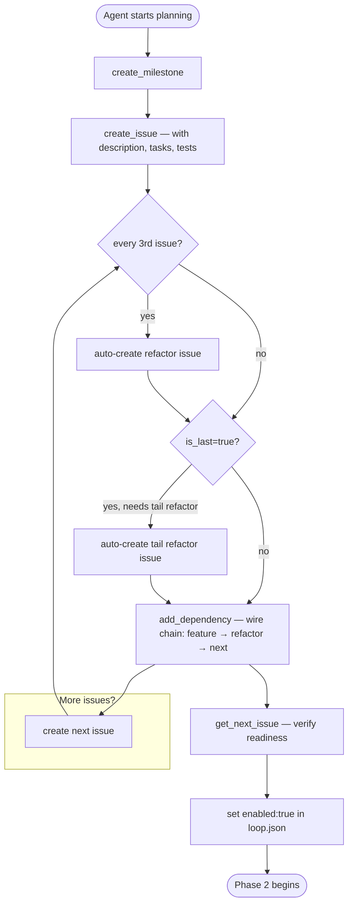
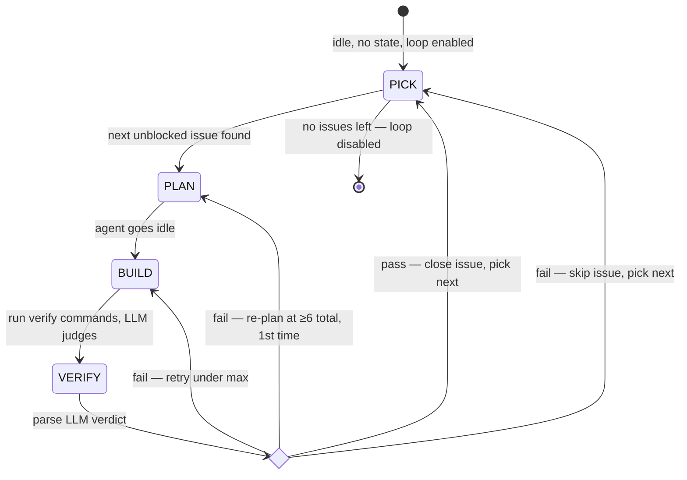

# Frank Grimes — Autonomous Coding Loop for opencode

An opencode plugin that autonomously picks up issues from your forge (Gitea/Forgejo,
GitLab, or GitHub), plans, builds, verifies, and closes them, when opencode
hits its idle state.

[!CAUTION]
> Make sure you have the money to have Frank burn the tokens.

## Install

1. Copy `grimes.ts` into `~/.config/opencode/plugins/` and `grimes_mcp.py` into `~/.config/opencode/`.
2. `bun install` (needs `@opencode-ai/plugin` — see `package.json`)
3. Add to `opencode.json`:
   ```json
   {
     "plugin": ["bun run plugins/grimes.ts"],
     "mcp": {
       "grimes": {
         "type": "local",
         "command": ["python3", "./grimes_mcp.py"]
       }
     }
   }
   ```
4. Create `.grimes/env` in your project root (pick **one** backend):

    ```
    # .grimes/env
    # Gitea:
    GITEA_URL=https://your-instance.com/owner/repo
    GITEA_TOKEN=your_token_here
    ```

    See `.grimes/env.example` for GitLab and GitHub options.

5. Create `.grimes/loop.json`:
   ```json
   { "enabled": true, "milestone_id": null, "create_mr": false, "max_retries": 2 }
   ```
6. Create `.grimes/verify.json`:
   ```json
   { "commands": ["bash check_types.sh"] }
   ```

## Agent Instructions

Add this to your `AGENTS.md` so the LLM knows how the loop works:

```markdown
## Frank Grimes Loop

When the loop is enabled, the plugin drives an idle loop on `session.idle`:
pick next issue → plan → build → verify → (pass → close + next) or (fail → retry / re-plan / skip)

### Your job
- **plan phase**: Read the issue, plan implementation, start coding
- **build phase**: Implement the solution, commit with `(refs #N)`
- **verify phase**: LLM always judges results — confirm implementation on pass, analyze real bug vs false positive on fail

### Commit conventions
- `<description> (refs #N)` while working
- `<description> (closes #N)` only when all tests pass

### How it fits together

Two components work together:

1. **grimes.ts** (opencode plugin) — the autonomous loop. Drives the state
   machine, picks the next unblocked issue, runs verify commands, closes issues
   on pass. Does NOT provide forge CRUD tools — it only reads issues and updates
   state.

2. **grimes_mcp.py** (MCP server) — forge CRUD tools for the agent. Provides
   `create_issue`, `create_milestone`, `add_dependency`, `get_next_issue`,
   `get_issue`, `list_issues`, `list_milestones`, `update_issue`. The agent
   calls these during the plan phase to set up work, create milestones, wire
   dependencies, and close issues.

Both components share the same forge credentials (`.grimes/env`). The MCP server is configured in `opencode.json` under
`mcpServers` and the plugin under `plugin` — opencode loads both on startup.

### Config files
- `.grimes/loop.json` — `enabled`, `milestone_id`, `create_mr`, `max_retries`
- `.grimes/verify.json` — `commands` array (strings or `{ "command": "...", "timeout_ms": 300000 }`)
- `.grimes/env` — forge credentials (GITEA_URL+GITEA_TOKEN, GITLAB_URL+GITLAB_TOKEN, or GITHUB_URL+GITHUB_TOKEN)

### Refactoring Intervals

When creating issues via `create_issue`, the MCP server automatically inserts a
refactoring issue after every 3 non-refactoring issues in the same milestone.
Each refactoring issue scans for ALL patterns and applies any that are applicable:

When `create_issue` returns a `refactor_issue` field, wire dependencies as:
`last_feature_issue -> refactor_issue -> next_feature_issue`

### Error handling
- Config/auth errors disable the loop (fix the env file, re-enable)
- Network errors retry 3x then skip
- API errors log and skip

### Disable the loop
Set `enabled: false` in `.grimes/loop.json`
```

## Verify Commands

Each command can be a string (default 120s timeout) or an object:
```json
{
  "commands": [
    "bun test",
    { "command": "cargo test", "timeout_ms": 300000 }
  ]
}
```

## Supported Backends

| Backend | URL format |
|---------|------------|
| Gitea | `https://host/owner/repo` |
| GitLab | `https://host/group/project` |
| GitHub | `https://github.com/owner/repo` |

Set only ONE backend. The plugin auto-detects which one.

## How It Works

### Phase 1: Issue Planning (manual)

The agent uses MCP tools interactively to prepare work before enabling the loop.



Every 3rd non-refactor issue triggers a refactoring issue (scans all patterns). The last issue (`is_last`) may spawn a tail refactor. Dependencies are wired as: `A → refactor → B → refactor → C...`

### Phase 2: Autonomous Idle Loop

Driven by the opencode plugin on `session.idle`. Only three states are persisted (`plan → build → verify`); everything else is a transient action.



#### States

| State | What happens |
|-------|-------------|
| **PLAN** | Next unblocked issue picked (most dependents first). Agent receives issue context + planning prompt |
| **BUILD** | Agent writes code, commits with `(refs #N)`. On idle, verify commands run |
| **VERIFY** | Verify commands execute mechanically. LLM always judges: on pass, confirms implementation matches issue; on fail, decides real bug vs false positive |

#### Failure paths from VERIFY

| Condition | Action |
|-----------|--------|
| `attempt < max_retries` AND `total < 6` | Increment attempt → **BUILD** |
| `total ≥ 6`, first re-plan | Reset attempt, tell agent to try a different approach → **PLAN** |
| `total ≥ 6`, already re-planned once | Skip issue (comment + wontfix label) → **PICK** |
| `attempt ≥ max_retries` (before threshold) | Skip issue → **PICK** |

#### Issue selection

On PICK, the loop fetches all open issues in the milestone, filters to those with no open blockers, then sorts by:
1. Most open dependents (unblock the most downstream work first)
2. Lowest issue number (tiebreaker)

If the current milestone has no open issues, it checks other milestones for work before disabling.

## Debug

Set `GRIMES_DEBUG=1` to write logs to `.grimes/debug.log`.

## Also See

- `grimes_mcp.py` — MCP server for interactive forge tool use (issue/milestone CRUD)
- `AGENTS.md` — agent instructions for your project
