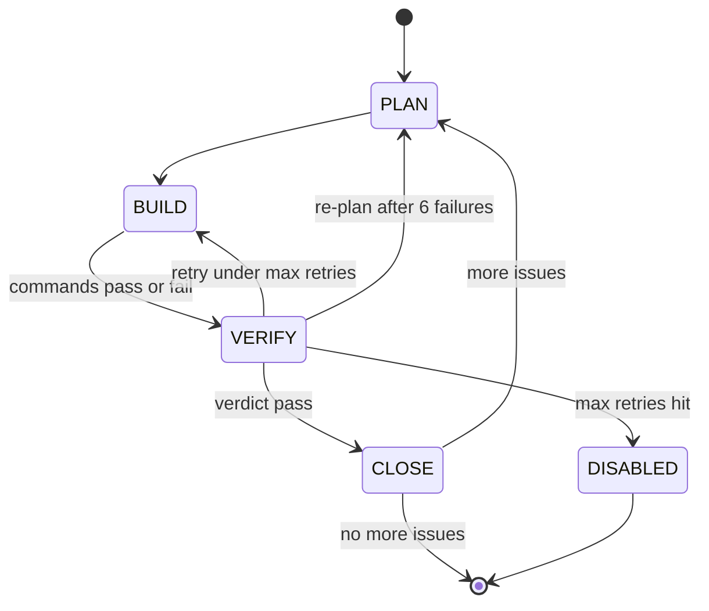

# Frank Grimes — Autonomous Forge Issue Loop for opencode

An opencode plugin that autonomously picks up issues from your forge (Gitea, GitLab, or GitHub), plans, builds, verifies, and closes them.

## Install

1. Copy `grimes.ts` into your project
2. `bun install` (needs `@opencode-ai/plugin`, `@opencode-ai/sdk` — see `package.json`)
3. Add to `opencode.json`:
   ```json
   {
     "plugin": ["bun run grimes.ts"],
     "mcpServers": {
       "grimes": {
         "command": "python3",
         "args": ["./grimes_mcp.py"]
       }
     }
   }
   ```
4. Create `.grimes/env` in your project root (pick **one** backend):

    ```
    # .grimes/env
    # Gitea:
    GITEA_URL=https://your-instance.com/owner/repo
    GITEA_TOKEN=your_token_here
    ```

    See `.grimes/env.example` for GitLab and GitHub options.

5. Create `.grimes/loop.json`:
   ```json
   { "enabled": true, "milestone_id": null, "create_mr": false, "max_retries": 2 }
   ```
6. Create `.grimes/verify.json`:
   ```json
   { "commands": ["bash check_types.sh"] }
   ```

## Agent Instructions

Add this to your `AGENTS.md` so the LLM knows how the loop works:

```markdown
## Frank Grimes Loop

When the loop is enabled, the plugin drives a state machine:
plan → build → verify → (pass → close + next issue) or (fail → retry or re-plan)

### Your job
- **plan phase**: Read the issue, plan implementation, start coding
- **build phase**: Implement the solution, commit with `(refs #N)`
- **verify phase**: If verify commands fail, analyze output and fix

### Commit conventions
- `<description> (refs #N)` while working
- `<description> (closes #N)` only when all tests pass

### How it fits together

Two components work together:

1. **grimes.ts** (opencode plugin) — the autonomous loop. Drives the state
   machine, picks the next unblocked issue, runs verify commands, closes issues
   on pass. Does NOT provide forge CRUD tools — it only reads issues and updates
   state.

2. **grimes_mcp.py** (MCP server) — forge CRUD tools for the agent. Provides
   `create_issue`, `create_milestone`, `add_dependency`, `get_next_issue`,
   `get_issue`, `list_issues`, `list_milestones`, `update_issue`. The agent
   calls these during the plan phase to set up work, create milestones, wire
   dependencies, and close issues.

Both components share the same forge credentials (`.grimes/env`). The MCP server is configured in `opencode.json` under
`mcpServers` and the plugin under `plugin` — opencode loads both on startup.

### Config files
- `.grimes/loop.json` — `enabled`, `milestone_id`, `create_mr`, `max_retries`
- `.grimes/verify.json` — `commands` array (strings or `{ "command": "...", "timeout_ms": 300000 }`)
- `.grimes/env` — forge credentials (GITEA_URL+GITEA_TOKEN, GITLAB_URL+GITLAB_TOKEN, or GITHUB_URL+GITHUB_TOKEN)

### Refactoring Intervals

When creating issues via `create_issue`, the MCP server automatically inserts a
refactoring issue after every 3 non-refactoring issues in the same milestone.
Each refactoring issue scans for ALL 15 patterns and applies any that are applicable:

| # | Pattern | What to look for |
|---|---------|-------------------|
| 0 | Extract Method | Long methods with distinct sections |
| 1 | Replace Magic Number with Constant | Raw literals in code |
| 2 | Replace Conditional with Polymorphism | Switch/if-else chains on type |
| 3 | Extract Class | Classes doing too much |
| 4 | Introduce Parameter Object | Related parameter groups (data clumps) |
| 5 | Replace Error Code with Exception | Return-code error handling |
| 6 | Encapsulate Collection | Exposed internal collections |
| 7 | Replace Type Code with Strategy | Enum-based behavior switching |
| 8 | Introduce Null Object | Repeated null checks |
| 9 | Consolidate Duplicate Conditional Fragments | Identical code in branches |
| 10 | Replace Inheritance with Delegation | Misused inheritance hierarchies |
| 11 | Move Method | Methods in the wrong class |
| 12 | Decompose Conditional | Complex boolean expressions |
| 13 | Replace Temp with Query | Unnecessary temporary variables |
| 14 | Form Template Method | Repeated algorithm structure across subclasses |

When `create_issue` returns a `refactor_issue` field, wire dependencies as:
`last_feature_issue -> refactor_issue -> next_feature_issue`

### Error handling
- Config/auth errors disable the loop (fix the env file, re-enable)
- Network errors retry 3x then skip
- API errors log and skip

### Disable the loop
Set `enabled: false` in `.grimes/loop.json`
```

## Verify Commands

Each command can be a string (default 120s timeout) or an object:
```json
{
  "commands": [
    "bun test",
    { "command": "cargo test", "timeout_ms": 300000 }
  ]
}
```

## Supported Backends

| Backend | URL format |
|---------|------------|
| Gitea | `https://host/owner/repo` |
| GitLab | `https://host/group/project` |
| GitHub | `https://github.com/owner/repo` |

Set only ONE backend. The plugin auto-detects which one.

## How It Works



### States

| State | What happens |
|-------|-------------|
| **PLAN** | Agent reads issue body, creates todo list, plans approach |
| **BUILD** | Agent writes code, commits with `(refs #N)` |
| **VERIFY** | Mechanical commands run. On pass: LLM checks if implementation matches issue description. On fail: LLM analyzes whether errors are real bugs or false positives |
| **CLOSE** | Issue closed via forge API, state cleared, next issue fetched |
| **DISABLED** | Loop paused — set `enabled: true` in `loop.json` to resume |

### Transitions

1. On `session.idle`, checks if the loop is enabled and no state exists
2. Calls the forge API to get the next unblocked issue
3. Creates an opencode session and starts the plan phase
4. On idle after plan → transitions to build
5. On idle after build → runs verify commands from `verify.json`
6. All pass → asks LLM to confirm implementation matches issue description
7. LLM passes → closes issue, picks next one
8. Commands fail → asks LLM to judge real bug vs false positive
9. LLM fails → retries build (up to `max_retries`), re-plans after 6 total failures

## Debug

Set `GRIMES_DEBUG=1` to write logs to `.grimes/debug.log`.

## Also See

- `grimes_mcp.py` — MCP server for interactive forge tool use (issue/milestone CRUD)
- `AGENTS.md` — agent instructions for your project
